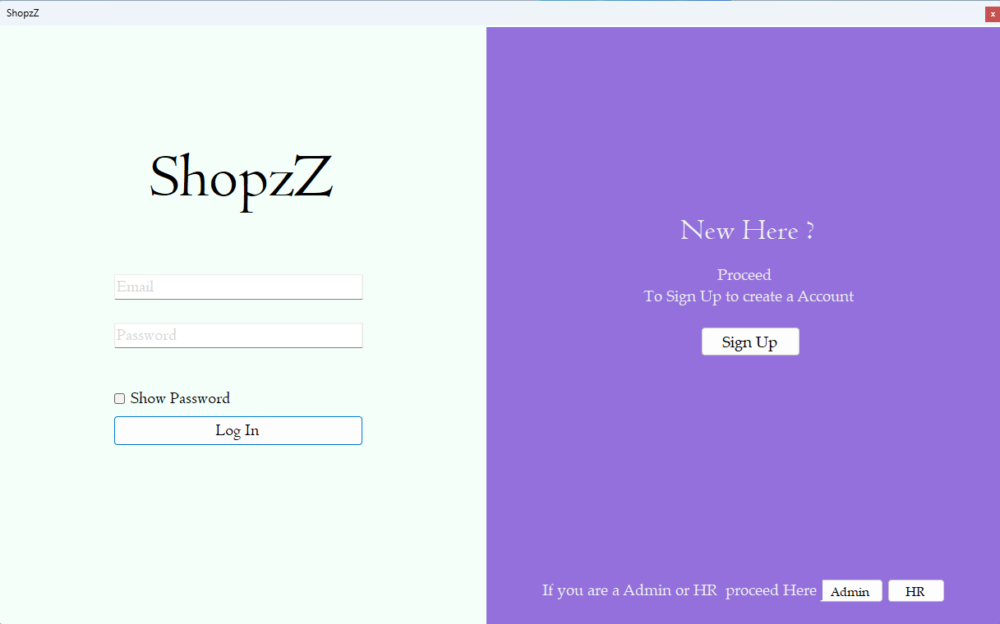
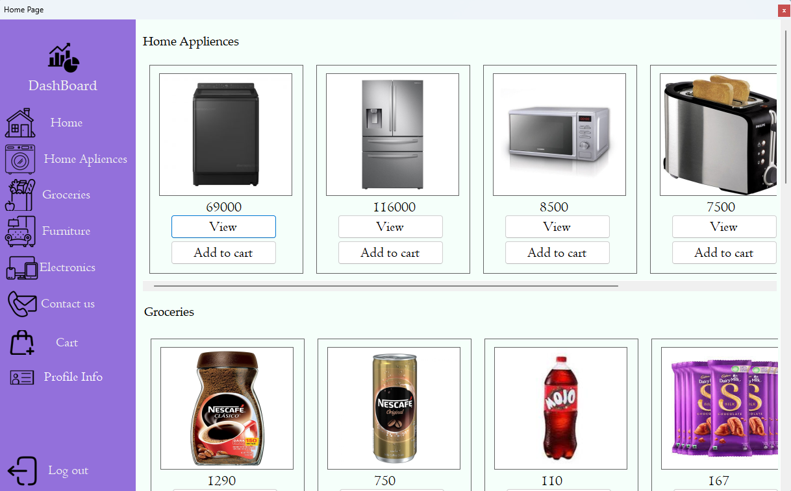
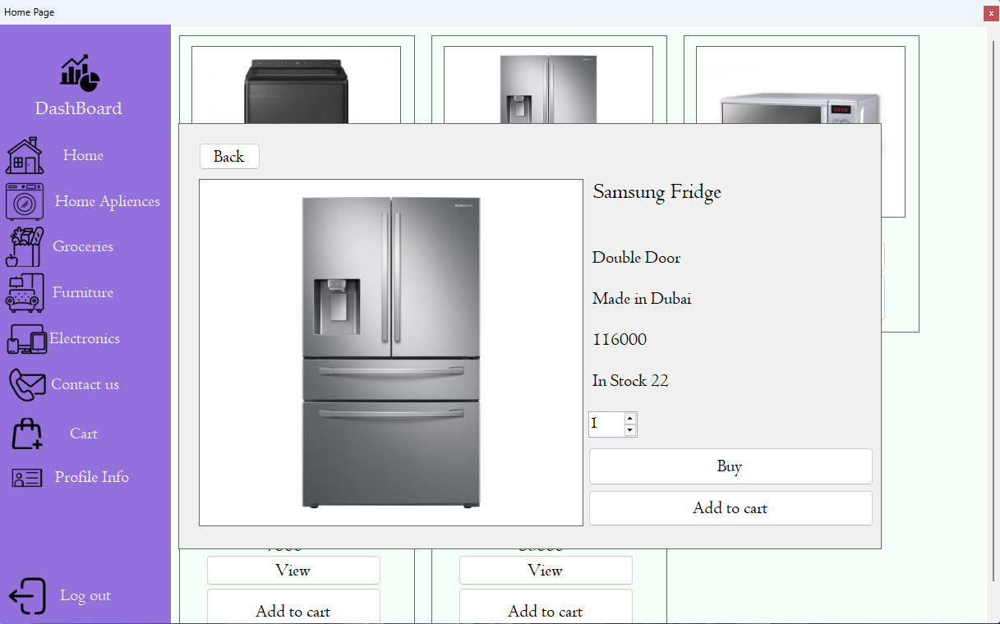
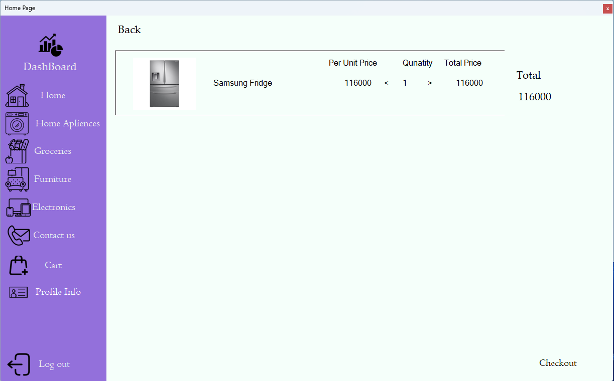
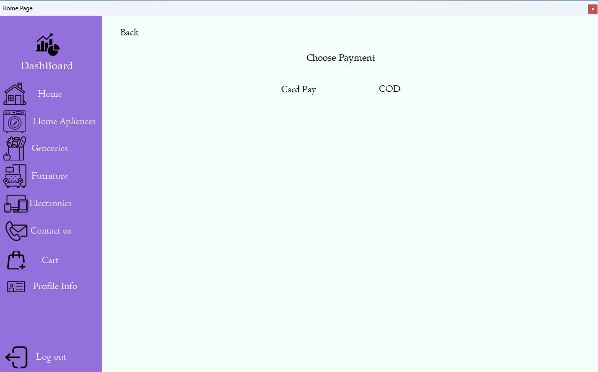
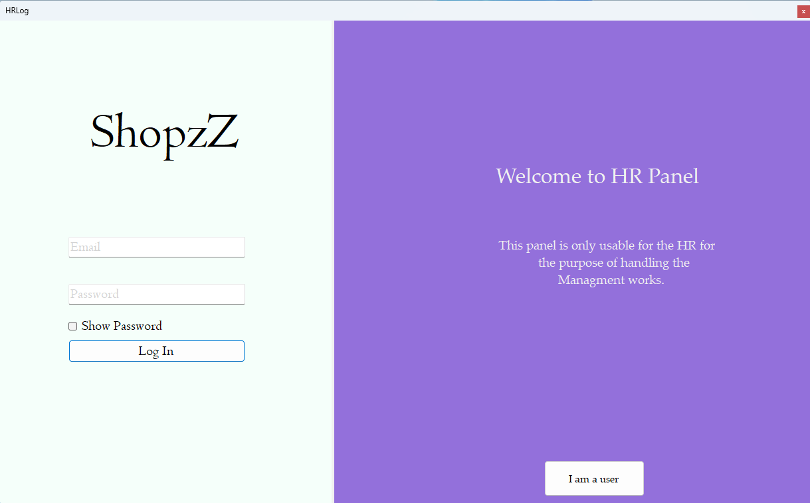

<div align="center">

<!-- 🔹 Project Screenshots (Auto Adjustable) -->

<br/>
 

<br/>





</div>

---

# 🏷️ WINFORMS-INVENTORY-MANAGMENT-APPLICATION  
*A lightweight, educational Inventory Management System built with C# WinForms*

---

## 📋 Table of Contents  
- [About](#about)  
- [Features](#features)  
- [Architecture & Tech Stack](#architecture--tech-stack)  
- [Getting Started](#getting-started)  
- [Usage](#usage)  
- [System Diagram](#system-diagram)  
- [To-Do / Roadmap](#to-do--roadmap)  
- [Contributing](#contributing)  
- [License](#license)  

---

## 🧩 About  
This project is designed to demonstrate **inventory management fundamentals** using **C# and WinForms**.  
It provides a clean interface to manage product lists, track stock, and interact with a local database — ideal for **students**, **junior developers**, or **desktop app demos**.

> ⚙️ Built for learning, not production — but easily extendable.

---

## 🚀 Features  
✅ CRUD operations for products (add, update, delete)  
✅ Stock tracking with quantity and pricing  
✅ Search and filter products  
✅ Local database integration  
✅ Simple, intuitive WinForms interface  
✅ Easily customizable architecture  

---

## 🧱 Architecture & Tech Stack  

| Layer | Technology | Description |
|:------|:------------|:------------|
| UI Layer | **WinForms (C#)** | Desktop GUI for product & stock management |
| Logic Layer | **C# Classes** | Business logic for product operations |
| Data Layer | **SQL Server / LocalDB** | Persistent data storage |
| IDE | **Visual Studio 2019+** | Development environment |

> 🧭 The solution follows a simple 3-layer architecture (UI → Logic → Data) for clarity and maintainability.

---

## ⚙️ Getting Started  

### Prerequisites  
- Windows OS  
- Visual Studio 2019 or newer  
- .NET Framework (same version as project)  
- SQL Server / LocalDB  

### Setup  
```bash
git clone https://github.com/AkibAshfaq/WINFORMS-INVENTORY-MANAGMENT-APPLICATION.git
